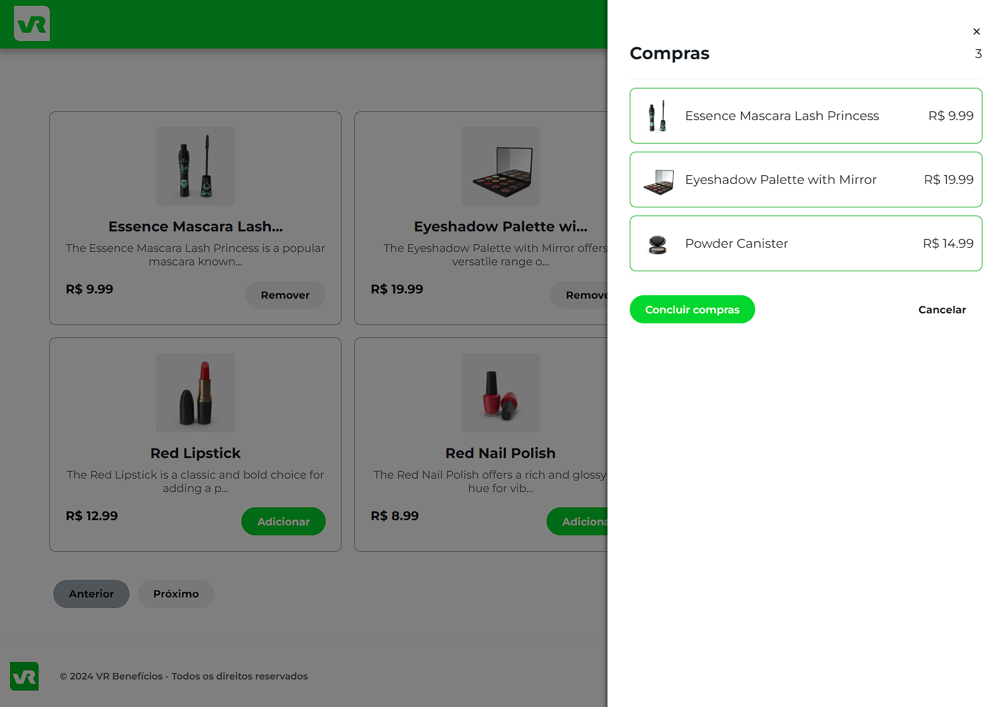

# Micro frontend - Module Federation


Essa é uma aplicação ReactJS que utiliza a arquitetura Module Federation para descentralização de aplicativos e componentes. Ela possui um app central (host) e mais 3 aplicações, sendo elas: Header, Footer e Cards que consome uma lista de produtos da API (https://dummyjson.com/docs/products). Além disso, existe uma interação da lista de produtos com o Header, onde o mesmo exibe um modal/drawer com a lista de produtos selecionados.

<center></center>

## Conteúdo

- [Micro frontend - Module Federation](#micro-frontend---module-federation)
  - [Conteúdo](#conteúdo)
  - [Deploy](#deploy)
  - [Funcionalidades](#funcionalidades)
  - [Instalação](#instalação)
  - [Uso](#uso)
  - [Contribuição](#contribuição)
  - [License](#license)

## Deploy

Você pode ver o deploy dessa aplicação aqui: [Vercel](https://app-starwars-vue3.vercel.app/)

## Funcionalidades

- [x] A aplicação deve conter um app central (host)
- [x] A aplicação deve conter um app Header (header)
- [x] A aplicação deve conter um app Footer (footer)
- [x] A aplicação deve conter um app Cards (cards)
- [x] O app Cards deve ter uma lista de produtos consumidos da API https://dummyjson.com/docs/products
- [x] A aplicação deve ter uma intereção entre a lista de produtos com o Header
- [x] O Header deve exibir um modal com a lista de produtos selecionados
- [x] Essa interação deve usar um gerenciador de estado (Context-API)
- [ ] A aplicação Cards deve ter testes unitários usando Jest e RTL
- [ ] A aplicação Header deve ter testes unitários usando Jest e RTL
- [ ] A aplicação Host deve ter um teste e2e usando cypress

## Instalação

Clone o repositório

```bash
git clone git@github.com:renatokhael/challenge-microfrontend-vr.git
```

Entre nos diretórios host, header, footer e cards, instale as dependencias e rode `npm run dev`,

```
npm i
npm run dev
```

Você deve ter cada instancia rodando um componente isoladamente mas seguintes URLs.

```
host: http://localhost:3000/mf-manifest.json
header: http://localhost:3001/mf-manifest.json
cards: http://localhost:3002/mf-manifest.json
footer:http://localhost:3003/mf-manifest.json
```

Você pode visualizar a aplicação completa através do host: `http://localhost:3000/mf-manifest.json`

## Uso

Rode como desenvolvedor:

```bash
npm run dev
```

Build para produção:

```bash
npm run build
```

Pré-visualização do build de produção:

```bash
npm run preview
```

## Contribuição

Contribuições são bem-vindas! Siga estas etapas para contribuir:

- Bifurque o projeto.
- Crie sua branch de recursos: `git checkout -b feature/my-new-feature`.
- Confirme suas alterações: `git commit -am 'Adicionar algum recurso`'.
- Envie para o branch: `git push origin feature/my-new-feature`.
- Envie uma solicitação pull.

## License

Esse é um projeto pessoal, e pode ser utilizado, copiado sem aviso prévio.

Made with 💚 by [Renato Khael](https://renatokhael.dev)
